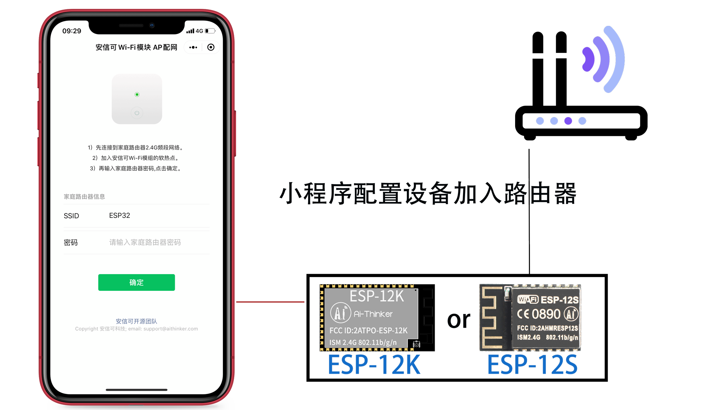
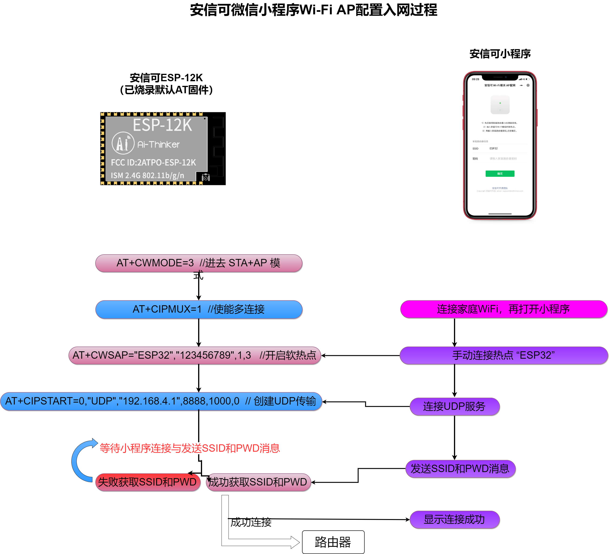

# 微信小程序 AP 配网安信可 Wi-Fi 模块入网示例




## 一 材料准备

- 设备：已烧录出厂 **AT 固件**的安信可 ESP-12S，ESP32-S和ESP-12K模组；
- 微信小程序：自行具备微信小程序开发能力基础；
- 淘宝链接：https://item.taobao.com/item.htm?id=620794721326

# 二 实现目的

通过微信小程序配置未入网的安信可Wi-Fi模组连接家庭2.4G路由器，实现连接云端服务器；

# 三 配置的数据交互协议

## 3.1 小程序发送网络信息阶段

- 微信小程序发送配置网络的信息：

```c++
{ 
  "port":61691 , //微信小程序本地端口，代码获取
  "password":"12345678" , //要连接的家庭网络路由器的密码
  "ssid":"xuhong@aithinker" //要连接的家庭网络路由器的SSID
}
```

- 模组返回以下信息，以表示成功收到配置网络的信息：

```c++
{ 
  "result": 0 ,  //错误码
}
```

## 3.2 模组连接路由器的回调：

- 模组返回以下信息格式：

```c++
{ 
  "code": 1 , // 错误码
}
```

| 错误码 | 含义                                    |
| ------ | --------------------------------------- |
| 0      | 设备成功收到信息                        |
| 1      | 设备成功解析到小程序发来的SSID和PWD信息 |
| 2      | 设备成功连接到路由器                    |
| 3      | 设备失败连接到路由器                    |

# 四 配置原理和过程



# 五 设备端 AT 交互过程

命令顺序：

| AT顺序                                        | 说明                                   |
| --------------------------------------------- | -------------------------------------- |
| AT+CWMODE=3                                   | STAT+AP模式                            |
| AT+CIPMUX=1                                   | 设置多连接                             |
| AT+CWSAP="ESP32","123456789",1,3              | 设置软热点                             |
| AT+CIPSTART=0,"UDP","192.168.4.1",8888,1000,0 | 开启UDP服务（等待小程序发来SSID和PWD） |
| AT+CIPSENDEX=0,10,"192.168.4.2",63665         | 解析OK，回复给小程序                   |
| {"code":0}                                    | 协议，见上章                           |
| AT+CWJAP="iot@xuhongv","xuhong12345678"       | 根据小程序发来的SSID和PWD连接路由器    |
| AT+CIPSENDEX=0,10,"192.168.4.2",63665         | 解析OK，回复给小程序                   |
| {"code":2}                                    | 协议，见上章                           |

详细的交互抓取：

```c
Ai-Thinker Technology Co. Ltd.

ready
WIFI CONNECTED
WIFI GOT IP
AT+CWMODE=3

OK
AT+CIPMUX=1

OK
AT+CWSAP="ESP32","123456789",1,3

OK
AT+CIPSTART=0,"UDP","192.168.4.1",8888,1000,0
0,CONNECT

OK
+STA_CONNECTED:"f8:87:f1:0f:35:3b"
+DIST_STA_IP:"f8:87:f1:0f:35:3b","192.168.4.2"
+DIST_STA_IP:"f8:87:f1:0f:35:3b","192.168.4.2"

+IPD,0,63:{"port":63665,"password":"xh12345678","ssid":"iot@xuhongv"}
AT+CIPSENDEX=0,10,"192.168.4.2",63665

收：OK

>busy p...

Recv 10 bytes

SEND OK
AT+CWJAP="iot@xuhongv","xh12345678"
WIFI DISCONNECT
WIFI CONNECTED
WIFI GOT IP

OK
```